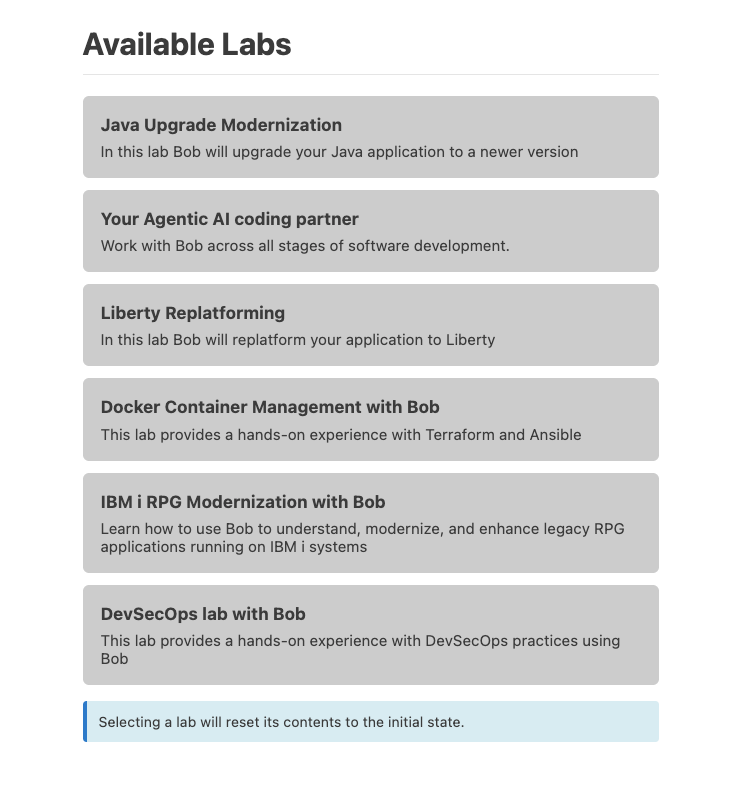

# Welcome to Bob Field Demos

## This community repo contains materials to demonstrate a variety of scenarios for Bob

The intial content is the set of labs that were delivered at **IBM TechXchange 2026**. These labs can all be accessed via walkthroughs inside Bob IDE.

---

### Gettting Started

- Clone/Download this repo onto your laptop.

- Rename the directory to **'txc-lab'**. *This is only temporary, the walkthroughs only get activated if it detects the directory name is 'txc-lab', we are working to resolve this.*

- On Bob IDE, open the folder. 

- You should see a set of labs like in the screenshot below. 

- Follow the directions in each Walkthrough to go through the demo scenarios.

---

### Demo scenarios on YouTube

We have uploaded video recordings of some of these scenarios on Bob's YouTube channel. 
[Link to Playlist](https://www.youtube.com/@ibm-bob/playlists).

---
